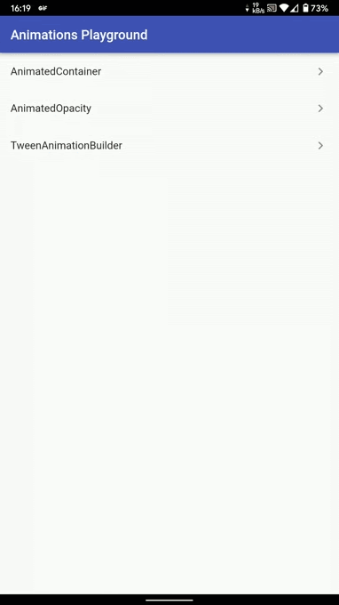
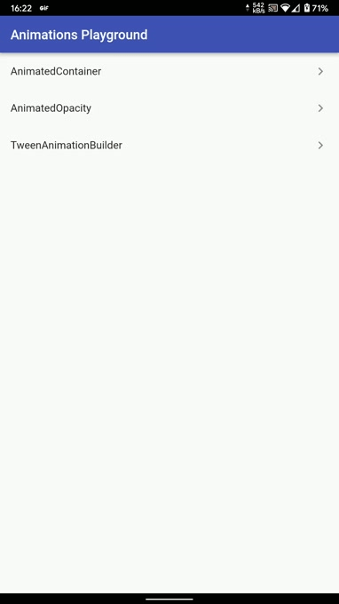

# Animations Playground

## 📱Screens 
  

   </img>
  </img>
  

## 🛠 Technology 🚀

This project was developed using the following libraries and technology:

- <a href="https://flutter.dev/">Flutter 2.5</a>

## 💻 About

This app is part of a course I am taking on how to work with implicit and explicit animations in Flutter. On this app you can see basic animations triggered by pressing a button, but it can be modified to the build method easily.

---
Made with ♥ by Mariugo 🚀
